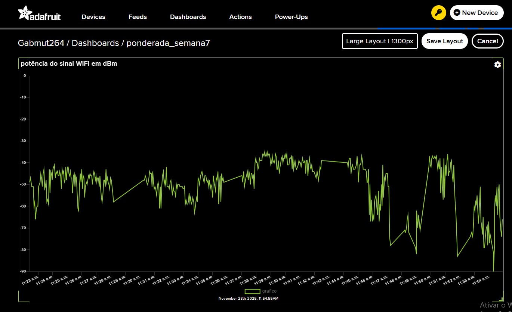

# ATIVIDADE – Medição de dBm e Envio ao Adafruit IO

## 1. Objetivo da Atividade

O objetivo desta atividade é medir continuamente a intensidade do sinal Wi-Fi (RSSI, em dBm) utilizando um ESP32 e enviar esses valores para a plataforma **Adafruit IO**, onde eles são exibidos em tempo real em um dashboard (no caso, o dashboard *ponderada_semana7*).
Essa visualização permite analisar a qualidade da conexão ao longo do tempo e observar variações no sinal.

---

## 2. Descrição do Funcionamento

O ESP32 é conectado à rede Wi-Fi da instituição e, a cada alguns segundos, realiza a leitura do valor de RSSI. O RSSI representa a força do sinal recebido, em dBm, onde valores mais próximos de **0** indicam sinal mais forte (ex.: −40 dBm), enquanto valores mais negativos indicam sinal mais fraco (ex.: −90 dBm).

Após obter o valor do sinal, o dispositivo envia o dado para um **feed** dentro do Adafruit IO.
No caso desta implementação, o feed utilizado se chama **grafico**.
Esse feed está conectado a um gráfico dentro do dashboard, que automaticamente registra:

* **Eixo Y:** valores de dBm
* **Eixo X:** timestamps gerados automaticamente pelo Adafruit IO em cada envio

Assim, constrói-se um gráfico em tempo real mostrando a variação do sinal ao longo do tempo.

---

## 3. Código

A seguir está o trecho principal utilizado:

```cpp
#include <WiFi.h>
#include "AdafruitIO_WiFi.h"

const char* WIFI_SSID = "xxx";
const char* WIFI_PASS = "xxx";

#define IO_USERNAME  "xxx"
#define IO_KEY       "xxx"

AdafruitIO_WiFi io(IO_USERNAME, IO_KEY, WIFI_SSID, WIFI_PASS);
AdafruitIO_Feed *dbmFeed = io.feed("grafico");

void setup() {
  Serial.begin(115200);
  io.connect();

  while(io.status() < AIO_CONNECTED) {
    delay(500);
  }
}

void loop() {
  io.run();
  int dbm = WiFi.RSSI();
  dbmFeed->save(dbm);
  delay(3000);
}
```

### O que cada parte faz

* **Bibliotecas (`WiFi.h` e `AdafruitIO_WiFi.h`)**
  São responsáveis pela conexão ao Wi-Fi e à plataforma Adafruit IO.

* **Configurações de Wi-Fi e chave da conta**
  Define o SSID da rede e as chaves de autenticação do Adafruit IO.

* **Objeto `AdafruitIO_WiFi`**
  É o módulo que gerencia a comunicação do ESP32 com o Adafruit IO.

* **Feed `"grafico"`**
  Local onde os valores serão armazenados na nuvem.

* **`setup()`**

  * Inicia o Serial
  * Conecta ao Adafruit IO
  * Aguarda a conexão estabilizar

* **`loop()`**

  * Mantém a conexão viva (`io.run()`)
  * Lê o RSSI com `WiFi.RSSI()`
  * Envia o valor ao feed
  * Aguarda 3 segundos para o próximo envio

---

## 4. Resultados – Dashboard

<div align="center"> 

</div>

No momneto em que o grafico está mais embaixo é quando a internet está pior, repare que perto do final do grico tem uma parte que chega no noventa, que foi quando eu entrei no elevador e perdeu o sinal de internet.

---

## 5. Vídeo de Demonstração

Link do Drive com o video: https://drive.google.com/file/d/15n__ioP5Dbr-5OLDxFcpUYM_0vSyRygp/view?usp=sharing

---
